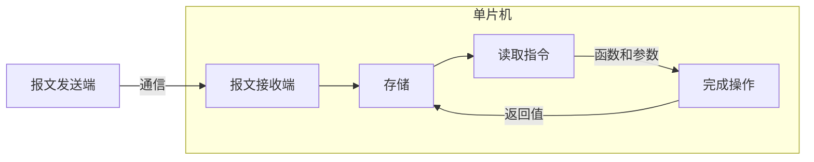
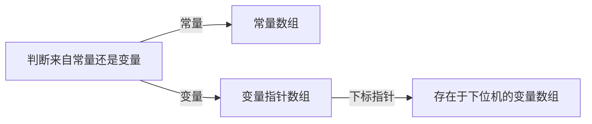
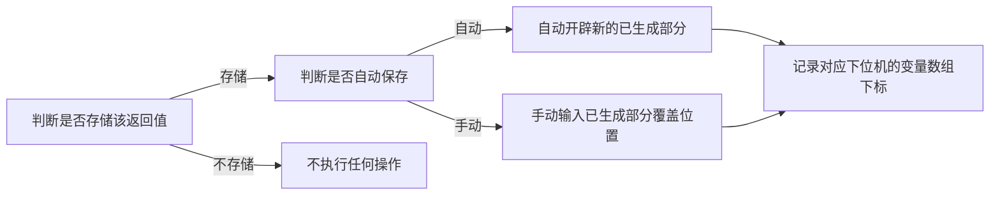

*我们在使用无线嵌入式器件的时候，或多或少对于AT指令都有所了解——通过通信口发送一串字符，以AT开头，换行符结尾，中间插入指令内容，就可以实现对芯片寄存器的配置。这种指令式配置类似于蓝牙、WiFi等设备可能比较简单，但是如果我们打算用它去实现一个比较复杂的编程呢？是否也可以通过这种方式，是否可以在不使用编译器的情况下，通过指令调取内部程序并执行？我将会通过一个小demo进行测试这种编程方式的可行性。*
**[本文的程序可以在这里下载](https://github.com/yunwuhai/MassagePrograming)**

<!-- @import "[TOC]" {cmd="toc" depthFrom=1 depthTo=6 orderedList=false} -->

<!-- code_chunk_output -->

- [使用工具](#使用工具)
- [工作流程](#工作流程)
- [指令程序设计](#指令程序设计)
- [功能映射并单指令运行](#功能映射并单指令运行)
- [多指令运行](#多指令运行)
- [上位机编程](#上位机编程)
- [传递参数](#传递参数)
- [返回值](#返回值)
- [思路解析](#思路解析)
  - [参数](#参数)
  - [返回值](#返回值-1)
  - [变量和常量](#变量和常量)
    - [输入判断](#输入判断)
    - [输出判断](#输出判断)
- [报文](#报文)
- [总结和反思](#总结和反思)

<!-- /code_chunk_output -->


## 使用工具

Code::Blocks， C语言

---

## 工作流程

整个系统的工作流程比较简单，如下图所示：



这里的报文内容其实来自于上位机对下位机内部已有程序的映射，例如我在单片机中已经设置好了一个函数void Exp()，那么我们就可以在上位机制作一个模块，使用者如果调取了这个模块那么上位机就会自动将该模块对应的指令值插入到报文中，假设这里是0x05，那么下位机如果在报文中检测到了0x05，就会自动执行Exp()函数。

当然详细内容会更复杂，我们现在只是有了一个基本概念，还需要继续完善内容。

---
## 指令程序设计

如果我们需要实现指令编程，那么内部肯定不止有Exp()一个程序，先不考虑指针传参的情况，我们根据参数和返回值的不同情况可以将函数分为以下几种情况：

1. 无参数无返回值
2. 无参数有返回值
3. 有参数无返回值
4. 有参数有返回值

而实际上参数的个数不定，我们暂时先不考虑不定参数的情况，可以分为：

1. 单个参数
2. 多个参数

而实际上多个参数的情况可以包含单个参数，那么我们就在这个demo中设置如下几种情况。

1. 无参数无返回值函数
2. 无参数有返回值函数
3. 两个参数无返回值函数
4. 三个参数有返回值函数

为此，我设计了如下几个函数：

```c
/*
 * 全局变量声明
 */
int static flag = 0;

/*
 *	函数声明和定义
 */

void SayHello() // 打印一行Hello World!
{
    printf("Hello World!\n");
}

int NowFlag()   // 将flag值自增一然后打印出来并返回
{
    flag++;
    printf("flag = %d\n", flag);
    return flag;

}

void ShowSum(int a, int b)  // 打印两个参数之和
{
    printf("%d + %d = %d\n", a, b, a+b);
}

int GetSum(int a, int b, int c) // 打印并返回三参数之和
{
    int sum = a + b + c;
    printf("%d + %d + %d = %d\n",a, b, c, sum);
    return sum;
}
```

现在我们在main中测试调用他们并运行一下：

```c
#include <stdio.h>
#include <stdlib.h>

/*
 * 全局变量声明
 */

/*
 *	函数声明和定义
 */

int main()
{
    SayHello();
    NowFlag();
    NowFlag();
    ShowSum(GetSum(0, 1, 2), 2);
    return 0;
}
```

运行结果为：


---
## 功能映射并单指令运行

我们已经写好并确定以上四个程序可以运行了，接下来我们对不同的功能进行编码映射，这样我们就可以选择不同指令完成不同的操作了。

```c
int main()
{
    unsigned char instruction = 0x03;  // 指令
    switch(instruction) // 判断指令
    {
    case 0x01:
        {
            SayHello();
            break;
        }
    case 0x02:
        {
            NowFlag();
            break;
        }
    case 0x03:
        {
            GetSum(0, 1, 2);
            break;
        }
    case 0x04:
        {
            ShowSum(1, 2);
            break;
        }
    default:
        {
            break;
        }
    }
    return 0;
}
```

通过这个程序，我们可以完成单个预设指令实现操作了，这里选择指令0x03进行操作：


---
## 多指令运行

但是只能实现上面这中单指令运行很明显是远远不够的，我们还需要实现多指令运行，即一次性可以运行多条指令。

方法也很简单，只需要一个循环和一个数组就可以实现。

```c
#define MAX_LEN 6

int main()
{
    unsigned char instruction[MAX_LEN] = {0x03, 0x02, 0x01, 0x02, 0x04, 0x06};  // 指令
    for(int i = 0; i < MAX_LEN; i++)
    {
        switch(instruction[i]) // 判断指令
        {
        case 0x01:
            {
                SayHello();
                break;
            }
        case 0x02:
            {
                NowFlag();
                break;
            }
        case 0x03:
            {
                GetSum(0, 1, 2);
                break;
            }
        case 0x04:
            {
                ShowSum(1, 2);
                break;
            }
        default:
            {
                break;
            }
        }
    }
    return 0;
}
```

这样子就可以运行多条语句了：


---
## 上位机编程

不过很显然，现在这样子和上位机编程有很大区别，至少使用者就很没有参与感。所以我们在这里制作出一个编程功能，然后把生成报文发送给下位机程序，然后来执行。

```c
#include <stdio.h>
#include <stdlib.h>

#define MAX_LEN 60

/*
 * 全局变量声明
 */
int static flag = 0;

/*
 *	函数声明和定义
 */

void SayHello() // 打印一行Hello World!
{
    printf("Hello World!\n");
}

int NowFlag()   // 将flag值自增一然后打印出来并返回
{
    flag++;
    printf("flag = %d\n", flag);
    return flag;

}

void ShowSum(int a, int b)  // 打印两个参数之和
{
    printf("%d + %d = %d\n", a, b, a+b);
}

int GetSum(int a, int b, int c) // 打印并返回三参数之和
{
    int sum = a + b + c;
    printf("%d + %d + %d = %d\n",a, b, c, sum);
    return sum;
}

void Coding(unsigned char codeStr[])    // 上位机编程
{
    printf("请按顺序输入程序编号：1|SayHello, 2|NowFlag, 3|GetSum, 4|ShowSum, 5|编译\n");
    int i;  // 记录行号
    int inst;   // 程序编号，这里其实最好用
    for(i = 0; i <= MAX_LEN; i++)   // 程序不能超过最大长度
    {
        printf("%d|  ", i + 1); // 格式占用
        scanf("%d", &inst); // 获取指令
        if(inst == 5)       // 如果选择了编译则跳出循环
        {
            printf("编译成功！\n");
            codeStr[i] = 0x06;	// 任意可以结束下位机switch的命令
            break;
        }
        else if(inst > 5 || inst < 1)   // 如果输入指令错误，则提示错误并重新输入
        {
            printf("无当前指令！请重新输入！");
            i--;
        }
        else    //  如果正确输入，则将内容记录
        {
            codeStr[i] = inst * 0x01;
        }
        printf("\n");
    }
}

int main()
{
    unsigned char instruction[MAX_LEN];// 指令存储器
    Coding(instruction);    // 获取指令
    for(int i = 0; i < MAX_LEN; i++)
    {
        switch(instruction[i]) // 判断指令
        {
        case 0x01:
            {
                SayHello();
                break;
            }
        case 0x02:
            {
                NowFlag();
                break;
            }
        case 0x03:
            {
                GetSum(0, 1, 2);
                break;
            }
        case 0x04:
            {
                ShowSum(1, 2);
                break;
            }
        default:
            {
                break;
            }
        }
    }
    return 0;
}
```

这时当前的程序，我们可以根据宏定义中MAX_LEN的长度制作最大等长的程序设计，我随便编了一下，效果感觉还不错：


---
## 传递参数

现在我们已经可以完成任意的无参无返回的函数执行了，但是光是这样肯定远远不够，我们需要实现参数传递，为此我们需要另外新定义一个数组用来存储参数，然后每次在选择了指令后都会进入参数输入界面：

```c
#include <stdio.h>
#include <stdlib.h>

#define MAX_LEN 60

/*
 * 全局变量声明
 */
int static flag = 0;

/*
 *	函数声明和定义
 */

void SayHello() // 打印一行Hello World!
{
    printf("Hello World!\n");
}

int NowFlag()   // 将flag值自增一然后打印出来并返回
{
    flag++;
    printf("flag = %d\n", flag);
    return flag;

}

void ShowSum(int a, int b)  // 打印两个参数之和
{
    printf("%d + %d = %d\n", a, b, a+b);
}

int GetSum(int a, int b, int c) // 打印并返回三参数之和
{
    int sum = a + b + c;
    printf("%d + %d + %d = %d\n",a, b, c, sum);
    return sum;
}

void Coding(unsigned char codeStr[], int intStr[])    // 上位机编程
{
    printf("请按顺序输入程序编号：1|SayHello, 2|NowFlag, 3|ShowSum, 4|GetSum, 5|编译\n");
    int i;  // 记录行号
    int j = 0;  // 记录参数
    int paraNum;    // 记录参数个数
    int inst;   // 程序编号
    for(i = 0; i <= MAX_LEN; i++)   // 程序不能超过最大长度
    {
        printf("%d|  ", i + 1); // 格式占用
        scanf("%d", &inst); // 获取指令
        switch(inst)
        {
        case 1:
            {
                codeStr[i] = inst * 0x01;
                break;
            }
        case 2:
            {
                codeStr[i] = inst * 0x01;
                break;
            }
        case 3:
            {
                codeStr[i] = inst * 0x01;
                for(paraNum = 0; paraNum < 2; paraNum++)
                {
                    printf("请输入参数%d:", paraNum + 1);
                    scanf("%d", intStr+j);
                    j++;
                }
                break;
            }
        case 4:
            {
                codeStr[i] = inst * 0x01;
                for(paraNum = 0; paraNum < 3; paraNum++)
                {
                    printf("请输入参数%d:", paraNum + 1);
                    scanf("%d", intStr+j);
                    j++;
                }
                break;
            }
        case 5:
            {
                printf("编译成功！\n");
                codeStr[i] = 0x06;	// 任意可以结束下位机switch的命令
                return;
            }
        default:
            {
                printf("无当前指令！请重新输入！");
                i--;
            }
        }
        printf("\n");
    }
}

int main()
{
    unsigned char instruction[MAX_LEN];// 指令存储器
    int intParaStr[MAX_LEN * 3];    // int参数存储器，这里假设最大可能情况作为空间
    Coding(instruction, intParaStr);    // 获取指令
    int pIntPara = 0;   // 确定参数
    for(int i = 0; i < MAX_LEN; i++)
    {
        switch(instruction[i]) // 判断指令
        {
        case 0x01:
            {
                SayHello();
                break;
            }
        case 0x02:
            {
                NowFlag();
                break;
            }
        case 0x03:
            {
                int a = intParaStr[pIntPara];
                pIntPara++;
                int b = intParaStr[pIntPara];
                pIntPara++;
                ShowSum(a, b);
                break;
            }
        case 0x04:
            {
                int a = intParaStr[pIntPara];
                pIntPara++;
                int b = intParaStr[pIntPara];
                pIntPara++;
                int c = intParaStr[pIntPara];
                pIntPara++;
                GetSum(a, b, c);
                break;
            }
        default:
            {
                break;
            }
        }
    }
    return 0;
}
```

我们再次测试一下：


---
## 返回值

在记录返回值这一块，我终究还是遇到了问题，虽然从理论上只是一个数据传递的过程，但是因为我之前随意的态度导致代码过于凌乱，不得不咽下苦果在原有基础上进行大改。不过理论不变，所以前面的内容仍然是正确的，只是写代码的时候会很痛苦。

程序一共分为五个文件，这里先贴出程序：

```c
/******************************************************************
* @File name: MainWorking.c
* @Author: Yun
* @Date: 2020-11-24
* @Description: 本文件为c主函数
******************************************************************/
#include <stdio.h>
#include <stdlib.h>
#include <stdbool.h>
#include "UserProgram.h"
#include "AppProgram.h"

int main()
{
    unsigned char instruction[MAX_LEN];// 指令存储器
    CtrlOut O;
    CtrlIn I;
    unsigned int OutStr[MAX_LEN];
    Coding(instruction, &O, &I);
    MCUCtrl(instruction, OutStr, &O, &I);
}
```

```c
/******************************************************************
* @File name: UserProgram.c
* @Author: Yun
* @Date: 2020-11-24
* @Description: 本文件用于存储用户操作函数的定义
******************************************************************/

#include <stdio.h>
#include <stdlib.h>
#include <stdbool.h>
#include "UserProgram.h"


/* 无参无返回begin */

/*********************************************************
* Function name ：P_SayHello
* Description   ：打印一行Hello World
* Parameter     ：None
* Return        ：None
**********************************************************/
void P_SayHello()
{
    printf("Hello World!\n");
}

/* 无参无返回end */

/* 无参有返回begin */

/*********************************************************
* Function name ：P_NowFlag
* Description   ：内置一静态变量flag，每次调用会让flag自增一，然后输出值并返回
* Parameter     ：None
* Return        ：int, flag当前的值
**********************************************************/
int P_NowFlag()
{
    int static flag = 0;
    flag++;
    printf("flag = %d\n", flag);
    return flag;
}

/* 无参有返回end */

/* 有参无返回begin */


/*********************************************************
* Function name ：P_ShowSum
* Description   ：将两数相加并打印
* Parameter     ：
*       @a          作为加数的第一个整数
*       @b          作为加数的第二个整数
* Return        ：None
**********************************************************/
void P_ShowSum(int a, int b)
{
    printf("%d + %d = %d\n", a, b, a+b);
}

/* 有参无返回end */

/* 有参有返回begin */

/*********************************************************
* Function name ：P_GetSum
* Description   ：将三数相加并打印，返回结果
* Parameter     ：
*       @a          作为加数的第一个整数
*       @b          作为加数的第二个整数
*       @c          作为加数的第三个整数
* Return        ：int, 三个参数之和
**********************************************************/
int P_GetSum(int a, int b, int c)
{
    int sum = a + b + c;
    printf("%d + %d + %d = %d\n",a, b, c, sum);
    return sum;
}

/* 有参有返回end */
```

```c
/******************************************************************
* @File name: AppProgram.c
* @Author: Yun
* @Date: 2020-11-23
* @Description: 本文件用于存储上位机控制函数和下位机控制函数的定义
******************************************************************/

#include <stdio.h>
#include <stdlib.h>
#include <stdbool.h>
#include "AppProgram.h"
#include "UserProgram.h"

/******************************************* 上位机输出值控制 ********************************************************/

/*********************************************************
* Function name ：OutSavingCtrl
* Description   ：用于控制保存输出，如果控制有返回值的函数则可以使用
*                 在
* Parameter     ：
*       @O          结构体指针，该结构体内包含有控制所需的数组和值
* Return        ：None
**********************************************************/
void OutSavingCtrl(CtrlOut *O)
{
    int check;
    printf("请问是否保存输出结果？(1|是||否|0):");
    scanf("%d", &check);
    if(check == 0)  // 不保存
    {
        O->O_isSaving[O->pO_isSaving] = 0;  // 记录此处不保存输出结果
        O->pO_isSaving++;   // 让下标指向下一位
        printf("不保存此操作不输出...\n");
    }
    else if(check == 1) // 保存
    {
        O->O_isSaving[O->pO_isSaving] = 1;  // 记录此处保存输出结果
        O->pO_isSaving++;   // 让下标指向下一位
        IsAutoSaving(O);    // 判断是否自动保存
    }
    else    // 错误
    {
        printf("输入错误，请重新输入！\n");
        OutSavingCtrl(O);
    }
}

/*********************************************************
* Function name ：IsAutoSaving
* Description   ：用于控制自动保存，被用于OutSavingCtrl函数中，不建议单独使用
* Parameter     ：
*       @O          结构体指针，该结构体内包含有控制所需的数组和值
* Return        ：None
**********************************************************/
void IsAutoSaving(CtrlOut *O)
{
    int check;  // 判定是否自动保存
    unsigned int addr;  // 保存地址下标
    printf("请问是否自动保存？(1|自动||手动|0):");
    scanf("%d", &check);
    if(check == 0)  // 手动保存
    {
        printf("请手动输入保存地址下标：");
        scanf("%d", &addr);
        printf("此操作保存地址下标为：%d\n", addr);
        O->O_SavingAddr[O->pO_SavingAddr] = addr;   // 记录当前保存地址下标
        O->pO_SavingAddr++; // 让下标指向下一位
    }
    else if(check == 1) // 自动保存
    {
        printf("自动保存此操作输出值...\n");
        O->O_SavingAddr[O->pO_SavingAddr] = O->O_AutoSavingAddr;   // 记录自动保存下标
        printf("此操作保存地址下标为：%d\n", O->O_AutoSavingAddr);
        O->O_AutoSavingAddr++;  // 自动保存个数加一
        O->pO_SavingAddr++; // 让下标指向下一位
    }
    else
    {
        printf("输入错误，请重新输入！\n");
        IsAutoSaving(O);
    }
}


/******************************************* 上位机输入值控制 ********************************************************/

/*********************************************************
* Function name ：InReadCtrl
* Description   ：用于控制参数，有参数的操作都需要使用此函数
* Parameter     ：
*       @I          结构体指针，该结构体内包含有控制所需的数组和值
*       @paraNum     操作的参数个数
* Return        ：None
**********************************************************/
void InReadCtrl(CtrlIn *I, int paraNum)
{
    int check;  // 用于判断输入来源是否为返回值或手动输入
    int tempVal;    // 用于临时存储参数
    unsigned int tempAddr;   // 用于临时存储下标
    for(int i = 0; i < paraNum; i++)
    {
        printf("参数%d|请问该参数为其它函数输出还是手动输入值?(1|输出||手动|0):", i);
        scanf("%d", &check);
        if(check == 0)  // 手动保存
        {
            I->I_isRead[I->pI_isRead] = 0;  // 记录参数来自手动输入
            I->pI_isRead++; // 让下标指向下一位
            printf("请手动输入该参数：");
            scanf("%d", &tempVal);
            I->I_ReadVal[I->pI_ReadVal] = tempVal;  // 记录参数
            I->pI_ReadVal++;    // 让下标指向下一位
        }
        else if(check == 1) // 自动保存
        {
            I->I_isRead[I->pI_isRead] = 1;  // 记录参数来自输出值
            I->pI_isRead++; // 让下标指向下一位
            printf("请输入输出保存下标：");
            scanf("%d", &tempAddr);
            I->I_ReadVal[I->pI_ReadVal] = tempAddr;  // 此时记录下标值
            I->pI_ReadVal++;    // 让下标指向下一位
        }
        else
        {
            printf("输入错误，请重新输入！\n");
            i--;
        }
    }
}

/*********************************************** 上位机编程 **********************************************************/

/*********************************************************
* Function name ：Coding
* Description   ：用于上位机编程，此为上位机主程序，通过该程序可以编程CtrlOut结构体和CtrlIn结构体，以及一个操作指令数组，生成为传输给下位机的代码
* Parameter     ：
*       @codeStr[]          操作指令集数组
*       @O                 结构体指针，输出控制结构体
*       @I                 结构体指针，输入控制结构体
* Return        ：None
**********************************************************/
void Coding(unsigned char codeStr[], CtrlOut *O, CtrlIn *I)    // 上位机编程
{
    InitIO(I, O);
    printf("请按顺序输入程序编号：1|SayHello, 2|NowFlag, 3|ShowSum, 4|GetSum, 5|编译\n");
    int line;  // 记录指令号
    int inst;   // 程序编号
    for(line = 0; line <= MAX_LEN; line++)   // 程序不能超过最大长度
    {
        printf("%d|  ", line + 1); // 格式占用
        scanf("%d", &inst); // 获取指令
        switch(inst)
        {
        case 1: // 无参数无返回值
            {
                codeStr[line] = inst * 0x01;
                break;
            }
        case 2: // 无参数有返回值
            {
                codeStr[line] = inst * 0x01;
                OutSavingCtrl(O);
                break;
            }
        case 3: // 有参数无返回值
            {
                codeStr[line] = inst * 0x01;
                InReadCtrl(I, 2);
                break;
            }
        case 4: // 有参数有返回值
            {
                codeStr[line] = inst * 0x01;
                InReadCtrl(I, 3);
                OutSavingCtrl(O);
                break;
            }
        case 5:
            {
                printf("编译成功！\n");
                codeStr[line] = 0xff;	// 任意可以结束下位机switch的命令
                return;
            }
        default:
            {
                printf("无当前指令！请重新输入！");
                line--;
                break;
            }
        }
        printf("\n");
    }
    printf("当前已达到可编程最大长度！");
}

/*********************************************************
* Function name ：InitIO
* Description   ：用于初始化结构体，这样可以让IO结构体指针指向开头，该函数已被用于Coding和MCUCtrl函数，不建议单独使用
* Parameter     ：
*       @I          结构体指针，输入结构体
*       @O          结构体指针，输出结构体
* Return        ：None
**********************************************************/
void InitIO(CtrlIn *I, CtrlOut *O)
{
    I->pI_isRead = 0;
    I->pI_ReadVal = 0;
    O->O_AutoSavingAddr = 0;
    O->pO_isSaving = 0;
    O->pO_SavingAddr = 0;
}

/******************************************* 下位机输出值控制 ********************************************************/

/*********************************************************
* Function name ：MCUOutCtrl
* Description   ：用于下位机输出控制，每次有返回值的函数都需要将输出值通过此函数进行操作
* Parameter     ：
*       @OutStr[]           返回值保存数组
*       @O                 结构体指针，输出控制结构体
*       @OutVal             函数返回值
* Return        ：None
**********************************************************/
void MCUOutCtrl(int OutStr[], CtrlOut *O, int OutVal)
{
    if(!(O->O_isSaving[O->pO_isSaving]))  // 不保存
    {
        O->pO_isSaving++;   // 下标指向下一位
        return; // 结束输出控制
    }
    else    // 保存
    {
        O->pO_isSaving++;   // 下标指向下一位
        OutStr[O->O_SavingAddr[O->pO_SavingAddr]] = OutVal; // 当前操作对应的保存地址记录输出值
        O->pO_SavingAddr++; // 下标指向下一位
    }
}

/******************************************* 下位机输出值控制 ********************************************************/

/*********************************************************
* Function name ：MCUInCtrl
* Description   ：用于下位机输入控制，每次有参数的函数都需要将参数通过此函数进行操作，且每个参数都要操作
* Parameter     ：
*       @OutStr[]           返回值保存数组
*       @I                 结构体指针，输入控制结构体
*       @InVal              整型指针，输入控制结构体，即参数以指针传入
* Return        ：None
**********************************************************/
void MCUInCtrl(int OutStr[], CtrlIn *I, int *InVal)
{
    if(!(I->I_isRead[I->pI_isRead]))    // 手动保存
    {
        I->pI_isRead++;
        *InVal = I->I_ReadVal[I->pI_ReadVal];
        I->pI_ReadVal++;
    }
    else    // 自动保存
    {
        I->pI_isRead++;
        *InVal = OutStr[I->I_ReadVal[I->pI_ReadVal]];
        I->pI_ReadVal++;
    }
}

/*********************************************** 下位机控制 **********************************************************/

/*********************************************************
* Function name ：MCUCtrl
* Description   ：用于下位机控制，下位机通过IO指令判断执行对应的操作
* Parameter     ：
*       @instruction[]       操作指令集数组
*       @OutStr[]           返回值保存数组
*       @O                 结构体指针，输出控制结构体
*       @I                 结构体指针，输入控制结构体
* Return        ：None
**********************************************************/
void MCUCtrl(unsigned char instruction[], int OutStr[], CtrlOut *O, CtrlIn *I)
{
    InitIO(I, O);
    for(int i = 0; i < MAX_LEN; i++)
    {
        switch(instruction[i]) // 判断指令
        {
        case 0x01:
            {
                P_SayHello();
                break;
            }
        case 0x02:
            {
                int a = P_NowFlag();
                MCUOutCtrl(OutStr, O, a);
                break;
            }
        case 0x03:
            {
                int a, b;
                MCUInCtrl(OutStr, I, &a);
                MCUInCtrl(OutStr, I, &b);
                P_ShowSum(a, b);
                break;
            }
        case 0x04:
            {
                int a, b, c;
                MCUInCtrl(OutStr, I, &a);
                MCUInCtrl(OutStr, I, &b);
                MCUInCtrl(OutStr, I, &c);
                int d = P_GetSum(a, b, c);
                MCUOutCtrl(OutStr, O, d);
                break;
            }
        default:
            {
                return;
            }
        }
    }
}
```

```c
/******************************************************************
* @File name: UserProgram.h
* @Author: Yun
* @Date: 2020-11-23
* @Description: 本文件用于存储用户操作函数的声明
******************************************************************/
#ifndef PROGRAMMING_H_INCLUDED
#define PROGRAMMING_H_INCLUDED

/* 无参无返回begin */

void P_SayHello();

/* 无参无返回end */

/* 无参有返回begin */

int P_NowFlag();

/* 无参有返回end */

/* 有参无返回begin */

void P_ShowSum(int a, int b);

/* 有参无返回end */

/* 有参有返回begin */

int P_GetSum(int a, int b, int c);

/* 有参有返回end */

#endif // PROGRAMMING_H_INCLUDED
```

```c
/******************************************************************
* @File name: AppProgram.h
* @Author: Yun
* @Date: 2020-11-23
* @Description: 本文件用于存储上位机控制函数和下位机控制函数的声明以及相应参数的存储
******************************************************************/

#ifndef APPPROGRAM_H_INCLUDED
#define APPPROGRAM_H_INCLUDED

#define MAX_LEN 60  // 程序语句最长

/* 结构体 */

/***********************************
* Struct name   ：CtrOut
* Description   ：用于控制输出返回值
*                 在上位机使用的时候：首先判断当前是否需要保存返回值，并依次把结果记录在O_isSaving数组中
*                                    然后如果需要保存，则选择是否需要自动保存，自动保存等效于新建变量，手动保存等于赋值已有变量
*                                    如果是手动保存，则需要手动输入保存变量下标，在下位机中我们把保存的变量都放在一个数组中，参数可以通过下标从这里调用内容
*                                    如果是自动保存，则自动下标会自增1然后记录当前自动下标，比如第一次自动记录时自动下标为0，然后第二次为1
*                                       // 注意，如果在手动保存时选择了比自动下标更大的数可能会导致存储内容被覆盖
*                 在下位机使用的时候：实际应用中下位机需要单独另建空间对这些内容进行保存，在demo中我们会省略这部分内容
*                                    首先下位机在执行有返回值的操作时，会进行判断此次操作是否需要保存返回值，此时需要检测O_isSaving数组
*                                    在确定需要保存后，将会从O_SavingAddr数组中取出当前操作的下标，然后将其保存到自定义的函数返回值保存空间的指定下标位置
* Member        ：
*       @O_isSaving[MAX_LEN]            ：用于记录当前操作是否保存返回值 // 当且仅当有返回值时必须记录，1保存，0不保存
*       @pO_isSaving                    ：数组下标，扫描O_isSaving数组    // 每次读写后必须移动到下一位    // 初始化时需要赋值为0
*       @O_SavingAddr[MAX_LEN]          ：用于记录当前保存值地址 // 当且仅当保存返回值时必须记录，如果为自动保存则自动记录当前O_AutoSavingAddr，如果为手动保存则记录输入下标值
*       @pO_SavingAddr                  ：数组下标，扫描O_SavingAddr数组  // 每次读写后必须移动到下一位    // 初始化时需要赋值为0
*       @O_AutoSavingAddr               ：用于记录当前自动保存的个数   // 当且仅当自动保存时将此大小记录在O_SavingAddr中后自增一，否则不对此值执行任何操作  // 初始化时需要赋值为0
***********************************/
typedef struct CONTROL_OUT
{
    bool O_isSaving[MAX_LEN];
    unsigned int pO_isSaving;
    unsigned int O_SavingAddr[MAX_LEN];
    unsigned int pO_SavingAddr;
    unsigned int O_AutoSavingAddr;
}CtrlOut;


/***********************************
* Struct name   ：CtrIn
* Description   ：用于控制输入参数值
*                 在上位机使用的时候：首先判断当前参数来自手动输入还是来自输出返回值，这里可以把输入值理解为常量，把输出返回值理解为已有值变量，并将此记录在I_isReading数组中，
*                                    然后如果来自于输入值，即常量，则在I_ReadVal数组中记录一个数字
*                                    如果来自于返回值，即变量，则在I_ReadVal数组中记录一个下标，该下标可以在函数返回值保存数组中进行取值
*                                      //事实上这是一种不严谨的做法，因为两种数据类型一个是有符号，一个无符号，但是这里我们的数组比较短，所以可以暂时简便起见如此使用
*                 在下位机使用的时候：实际应用中下位机需要单独另建空间对这些内容进行保存，在demo中我们会省略这部分内容
*                                    首先下位机在执行有参数的操作时，会对每个参数进行判断当前参数来自于一个变量还是常量，
*                                    根据我们在I_isRead数组中的记录，如果为常量，即输入值，则直接将对应位置的I_ReadVal中的值取出作为参数
*                                    否则为变量，即返回值，需要先从I_ReadVal中取出对应位置的值作为下标，在自定义的函数返回值保存将对应下标的值取出作为参数
* Member        ：
*       @I_isRead[MAX_LEN * 3]          ：用于记录当前操作函数是否来自返回值  // 当且仅当有参数时必须记录，每个参数都要记录，1来自返回值，0来自输入值
*       @pI_isRead                      ：数组下标，扫描I_isReading数组   // 每次读写必须移动到下一位 // 初始化时需要赋值为0
*       @I_ReadVal[MAX_LEN * 3]         ：用于记录参数值，顺序表，对应每个参数 // 如果来自返回值则根据输入下标从O_SavingVal数组提取，如果来自输入值则直接记录输入
*       @pI_ReadVal                     ：数组下标，扫描I_ReadVal数组 // 每次读写必须移动到下一位 // 初始化时需要赋值为0
***********************************/
typedef struct CONTROL_IN // 控制参数值
{
    bool I_isRead[MAX_LEN * 3];
    unsigned int pI_isRead;
    int I_ReadVal[MAX_LEN * 3];
    unsigned int pI_ReadVal;
}CtrlIn;


void OutSavingCtrl(CtrlOut *O);
void IsAutoSaving(CtrlOut *O);
void InReadCtrl(CtrlIn *I, int paraNum);
void Coding(unsigned char codeStr[], CtrlOut *O, CtrlIn *I);
void InitIO(CtrlIn *I, CtrlOut *O);
void MCUOutCtrl(int OutStr[], CtrlOut *O, int OutVal);
void MCUInCtrl(int OutStr[], CtrlIn *I, int *InVal);
void MCUCtrl(unsigned char instruction[], int OutStr[], CtrlOut *O, CtrlIn *I);

#endif // APPPROGRAM_H_INCLUDED
```

写这段程序着实花了我挺大精力，重点是没有参照所以编程思路需要理清。程序还有很多可以改进的地方，具体我放在最后写，我用这段程序形成的代码写了一段程序：


程序的注释挺多的，要知道具体工作原理请直接看代码。

---
## 思路解析

就我写了这么多程序后，对于这部分的理解大概就是，我们其实在制作一个虚拟机解释器，类似于Java那种，当然这种程度相较于Java这类成熟的语言还远远不够，但是思路挺像，我在此归纳一下：

首先我们将底层抽象化，让人可以使用自然语言去理解我们想要作什么，这就是我们第一行的作用。这个过程其实类似于制作一个GUI，然后用户可以通过GUI去理解每个函数的作用，当然如果用GUI来制作的话我们可以得到更好的反馈效果。

然后第二步就是让使用者去编写程序了，因为每个人对编程的理解能力是不同的，我只能尽量从有普通理解能力的使用者出发，设计一些解释性语句，而使用者则根据这些语句输入相应的参数。因为用户其实就是简单地去运行程序，他并不知道也不需要知道底层的内容，他只想知道这个函数该怎么用就可以了。

而函数的运行除了内部的具体执行，对于应用层编程者来说其实只是涉及到两个关键点：一是**函数参数**从何而来，二是**返回结果**向何而去。

### 参数

参数的来历对于我们日常编程的人来说，主要分为两种：一是通过const修饰，使用宏定义修饰，或是直接以数字形式呈现的常量；另一个就是被赋值的变量。但是这里有一点需要注意，如果一个变量第一次被手动赋值初始化，然后它就直接传递给一个函数了，虽然从底层逻辑上来说它是一个变量，但是如果只是从实现的角度上来看，它其实和一个被宏定义的常量并没有太大的区别，我在程序里是直接将其认定为一个常量，这不严谨，但是很有效，不然还要另外写个赋值函数。

所以这里我们就懂了，参数来自于变量和常量，而常量肯定是使用者手动输入的，不作阐释，而变量呢？

### 返回值

因为我们清楚，如果我们将第一次被**手动赋值初始化**的变量当作了常量，那么显然第一次被**自动赋值**的变量当然就是我们所需要的变量了。而自动赋值，很明显就是被函数赋值。

所以我们可以推论所有的变量都来自于函数返回值，但是函数返回值不一定非要保存起来作为一个变量，他们是一个包含关系。

### 变量和常量

我们可以把常量和变量分为两个数组，然后我们每次只需要确定参数来自于那个常量或那个变量，而返回值是否保存而如果保存的话保存到哪即可。

所以我们需要两个指针，一个指向变量，一个指向常量，它们会在输入参数和输出返回值时工作。

#### 输入判断

在不重构的情况下，一个函数如果在定义时有参数，这个参数就必须赋值。

如果该参数为常量，它的值不会再改变，所以我们可以通过赋值将其永远存在常量数组中；

如果该参数为变量，它的值可能会发生改变，而且它的值来自于返回值，再不运行之前我们无法得知它的具体值，所以我们记录的不是它的值而是它的地址。

每个参数在每次操作中只可能是常量或是变量，所以我们可以通过一个数组记录每个参数对应的选择。

如果选择变量，我们就需要一个指针数组记录其对应的变量数组中的位置，当然使用下标会更加方便。在demo中我使用的下标，但是没有另外建立指针数组，我在程序中有标注和注释，主要是偷一下懒，在不超过int最大值的情况下这么写是没有太大问题的，不过最好还是另外定义一个数组。

如果选择常量，我们只需要将使用者输入值保存在常量数组中即可。


这样我们的执行步骤就是：



#### 输出判断

在不使用指针传参的情况下，一个函数如果在定义时有返回值，这个返回值输出可以被保存为变量，也可以不使用。

如果不保存这个变量，我们可以不对当前函数输出做任何操作。

如果保存这个变量，那么它就两种情况，一是作为一个新变量进行保存，另一个就是覆盖保存，新变量可以自动生成，我们可以用动态数组控制覆盖和自动，但是为了简单，我在demo中将变量数组定义为两部分，一是已生成部分，另一块是不定部分，只要我要求用户覆盖保存只能在已生成部分内，就不会出现太大问题（当然事实上我没有加这个判断，因为这个demo的使用者只是我，而如果你们要使用，肯定也会看我这篇文章以及程序里的注释），如果可以做出GUI界面，其实我们大可让用户无法知道居然还有不定部分，如果能让所有已经保存的变量都有名词显示那是最好的情况。

所以我们的执行步骤就是：



## 报文

通过以上部分，我们基本上可以得到我们所需的报文了，在不限定格式的情况下我们可以将不同功能的指令形成数组，串入：

1. 一串函数指令数组
2. 一串判断参数来自常量还是变量的数组
3. 一串常量数组
4. 一串记录输入对应变量下标的数组
5. 一串判断是否存储返回值
6. 一串记录输出对应变量下标的数组

注意，并不是我们在上位机执行的所有判断或操作都需要告知下位机，而下位机中的变量数组也并非来自于报文而是在执行中生成。

我们在真正传入报文时需要注意校验值，因为可能报文量较大，所以建议每隔几十个数据就校验一次，如果校验失败则重新传输。另外需要给下位机以提醒，告知其此时传输的内容为何值，即报头和报尾，而且尽量让报头和报尾足够长，以防错误检测数据报。

---
## 总结和反思

我们这些程序写出来后，实际上可以看作一个简单的新语言，它的底层是C，但是实际上被另外一种解释器层叠出单纯应用层的特性。我们可以对这种新语言进行包装，因为上位机并无语言限制，可以写成比较好看易交互的界面，然后处理成报文后发送给下位机即可。而下位机则作为一个解释器，对报文进行理解然后执行底层代码。

在编程的过程中，需要注意上位机和下位机的指针这些是不能互通的，但是我们可以通过下标的方式代替指针，或是通过赋值方法让下位机自动记录指针，这需要非常注意对内存的把控。因为解释器全在下位机，所以上位机不需要太复杂的应用，甚至可以部署在网页上，而通过前端或是应用端丰富的GUI，这种编程方式可以让外行人也能实现编程功能。

不过这目前只是一个demo方案，我本身也没有开发这种解释型语言的经验，这种编程方法的缺陷也很明显，即占内存、耗时较高，如果用于嵌入式可能不是很适合于告诉场合（当然我们也可以通过对底层函数的封装提高这个效率），但是至少它很有趣。

我在demo中写了很多注释，但是c基础一般的真要理解起来可能还是需要花一点功夫，另外demo中仍有很多改进空间，至少指针传参、重构函数这类操作还没有实现，而且使用数组传递很占用空间，如果可以使用动态数组会比现在这样好得多。还有我的一些变量名称没有选择好，所以理解起来会比较复杂。

才疏学浅，漏洞百出，如有意见或建议，欢迎留言评论，如果能点赞收藏关注那就更好不过了，嘿嘿。
