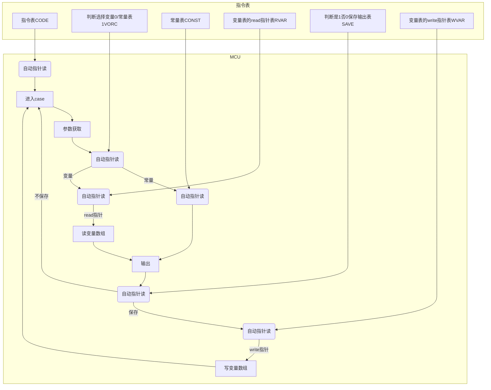
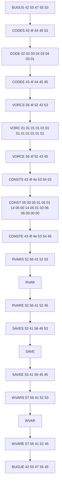

*这是对我之前《[如何假装用C语言为嵌入式写一个新语言](如何假装用C语言为嵌入式写一个新语言.md)》进行一个举例，以便更好地理解这种编程方式。*

<!-- @import "[TOC]" {cmd="toc" depthFrom=1 depthTo=6 orderedList=false} -->

<!-- code_chunk_output -->

- [报头(S)报尾(E)](#报头s报尾e)
- [控制指令](#控制指令)
- [程序逻辑指令](#程序逻辑指令)
- [举例](#举例)

<!-- /code_chunk_output -->

## 报头(S)报尾(E)

| 报头和报尾 | ASCII             |
| ---------- | ----------------- |
| BUGUS      | 42 55 47 55 53    |
| BUGUE      | 42 55 47 55 45    |
| CODES      | 43 4f 44 45 53    |
| CODEE      | 43 4f 44 45 45    |
| VORCS      | 56 4f 52 43 53    |
| VORCE      | 56 4f 52 43 45    |
| CONSTS     | 43 4f 4e 53 54 53 |
| CONSTE     | 43 4f 4e 53 54 45 |
| RVARS      | 52 56 41 52 53    |
| RVARE      | 52 56 41 52 45    |
| SAVES      | 53 41 56 45 53    |
| SAVEE      | 53 41 56 45 45    |
| WVARS      | 57 56 41 52 53    |
| WVARE      | 57 56 41 52 45    |

## 控制指令

| 指令内容                   | 指令标号（用户不可见） | 参数1                     | 参数2          |
| -------------------------- | ---------------------- | ------------------------- | -------------- |
| 输入输出选择（基础IO模块） | 0x02                   | 引脚选择（暂时0x01-0x0a） | 输入0输出1     |
| 输出高低选择（基础IO模块） | 0x03                   | 引脚选择（暂时0x01-0x0a） | 低电平0高电平1 |
| 毫秒级延时（时序模块）     | 0x04                   | 延时时间（暂时0x01-0xff） |                |

## 程序逻辑指令

| 指令内容                       | 指令标号 | 信息1      | 信息2      | 信息3       | 信息4      | 信息5      | 信息6      |
| ------------------------------ | -------- | ---------- | ---------- | ----------- | ---------- | ---------- | ---------- |
| 循环启动器（程序基础控制模块） | 0x01     | CODE返回位 | VORC返回位 | CONST返回位 | RVAR返回位 | SAVE返回位 | WVAR返回位 |

---

## 举例

加入用户输入了这样一个程序：

```mermaid
flowchat
st=>start: 开始
set5=>operation: 设置5号引脚为输入
set6=>operation: 设置6号引脚为输出
set6high=>operation: 设置6号输出为高电平
con=>condition: while(1)
blink_delay1=>operation: 延时20ms
blink_set0=>operation: 设置6号输出为低电平
blink_delay2=>operation: 延时20ms
blink_set1=>operation: 设置6号输出为高电平

st->set5->set6->set6high->con
con(yes)->blink_delay1->blink_set0->blink_delay2->blink_set1->con
```

而我们的MCU工作流程如下：



这里我们只截取其中一个函数的工作流程和并对循环方式进行说明：

```mermaid
sequenceDiagram
    participant P as 系统
    participant C as CODE
    participant V as VORC
    participant CO as CONST
    participant R as RVAR
    participant S as SAVE
    participant W as WVAR
    par 调用函数
    	C->>+P: 0x02
    	P-->>-C: 下标=1
    	Note over C,P: 输入输出选择
    and 传入形参
    	par 参数1
    	V->>+C: 0x01
    	C-->>-V: 下标=1
    	Note over V,C: 选择常数
    	CO->>+C: 0x05
    	C-->>-CO: 下标=1
    	Note over CO, C: 5号引脚
    	
    	and 参数2
    	V->>+C:0x01
    	C-->>-V: 下标=2
    	Note over V,C: 选择常数
    	CO->>+C: 0x00
    	C-->>-CO: 下标=2
    	Note over CO, C: 输入
    	end
    end
    
    par 调用函数
    	C->>+P: 0x02
    	P-->>-C: 下标=2
    	Note over C,P: 输入输出选择
    and 传入形参
    	par 参数1
    	V->>+C: 0x01
    	C-->>-V: 下标=3
    	Note over V,C: 选择常数
    	CO->>+C: 0x05
    	C-->>-CO: 下标=3
    	Note over CO, C: 6号引脚
    	
    	and 参数2
    	V->>+C:0x01
    	C-->>-V: 下标=4
    	Note over V,C: 选择常数
    	CO->>+C: 0x01
    	C-->>-CO: 下标=4
    	Note over CO, C: 输出
    	end
    end
    
    par 调用函数
    	C->>+P: 0x03
    	P-->>-C: 下标=3
    	Note over C,P: 输出高低选择
    and 传入形参
    	par 参数1
    	V->>+C: 0x01
    	C-->>-V: 下标=5
    	Note over V,C: 选择常数
    	CO->>+C: 0x05
    	C-->>-CO: 下标=5
    	Note over CO, C: 6号引脚
    	
    	and 参数2
    	V->>+C:0x01
    	C-->>-V: 下标=6
    	Note over V,C: 选择常数
    	CO->>+C: 0x01
    	C-->>-CO: 下标=6
    	Note over CO, C: 输出高电平
    	end
    end
    
    loop 循环启动器
    Note over P,W: 上位机中记录此时的下标：CODE=3,VORC=6,CONST=6,RVAR=0,SAVE=0,WVAR=0
    	par 调用函数
    		C->>+P: 0x04
    		P-->>-C: 下标=4
    		Note over C,P: 毫秒级延时
  		and 传入形参
    		par 参数1
    		V->>+C: 0x01
    		C-->>-V: 下标=7
    		Note over V,C: 选择常数
    		CO->>+C: 0x14
    		C-->>-CO: 下标=7
    		Note over CO, C: 20ms延时
    		end
    	end
    	
        par 调用函数
            C->>+P: 0x03
            P-->>-C: 下标=5
            Note over C,P: 输出高低选择
        and 传入形参
            par 参数1
            V->>+C: 0x01
            C-->>-V: 下标=8
            Note over V,C: 选择常数
            CO->>+C: 0x05
            C-->>-CO: 下标=8
            Note over CO, C: 6号引脚

            and 参数2
            V->>+C:0x01
            C-->>-V: 下标=9
            Note over V,C: 选择常数
            CO->>+C: 0x00
            C-->>-CO: 下标=9
            Note over CO, C: 输出低电平
            end
        end
        
        par 调用函数
    		C->>+P: 0x04
    		P-->>-C: 下标=6
    		Note over C,P: 毫秒级延时
  		and 传入形参
    		par 参数1
    		V->>+C: 0x01
    		C-->>-V: 下标=10
    		Note over V,C: 选择常数
    		CO->>+C: 0x14
    		C-->>-CO: 下标=10
    		Note over CO, C: 20ms延时
    		end
    	end
    	
    	par 调用函数
            C->>+P: 0x03
            P-->>-C: 下标=7
            Note over C,P: 输出高低选择
        and 传入形参
            par 参数1
            V->>+C: 0x01
            C-->>-V: 下标=11
            Note over V,C: 选择常数
            CO->>+C: 0x05
            C-->>-CO: 下标=11
            Note over CO, C: 6号引脚

            and 参数2
            V->>+C:0x01
            C-->>-V: 下标=12
            Note over V,C: 选择常数
            CO->>+C: 0x01
            C-->>-CO: 下标=12
            Note over CO, C: 输出高电平
            end
        end
    	
    	par 调用函数
            C->>P: 0x01
            Note over C,P: 循环回溯
        and 传入形参
            par CODE
            P->>C: 下标=3
            and VORC
            P->>V: 下标=6
            and CONST
            P->>CO:下标=6
            and RVAR
            P->>R:下标=0
            and SAVE
            P->>S:下标=0
            and WVAR
            P->>W:下标=0
            end
        end
        Note over P,W: 将下标指针返回到循环启动器开始时的状态
    end
```



这里需要注意的是在这个例子中我们其实并没有输出值的，所以没有对输出值进行操作，5号的demo版暂时先不做又返回值的功能。

通过以上的序列图，我们就可以写出我们的报文了：



​                   将该报文通过串口发送到单片机，单片机即可进行工作运行。